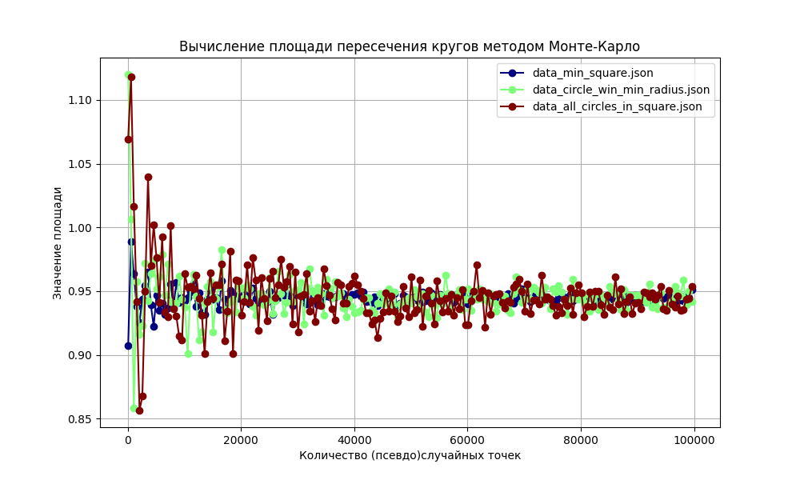
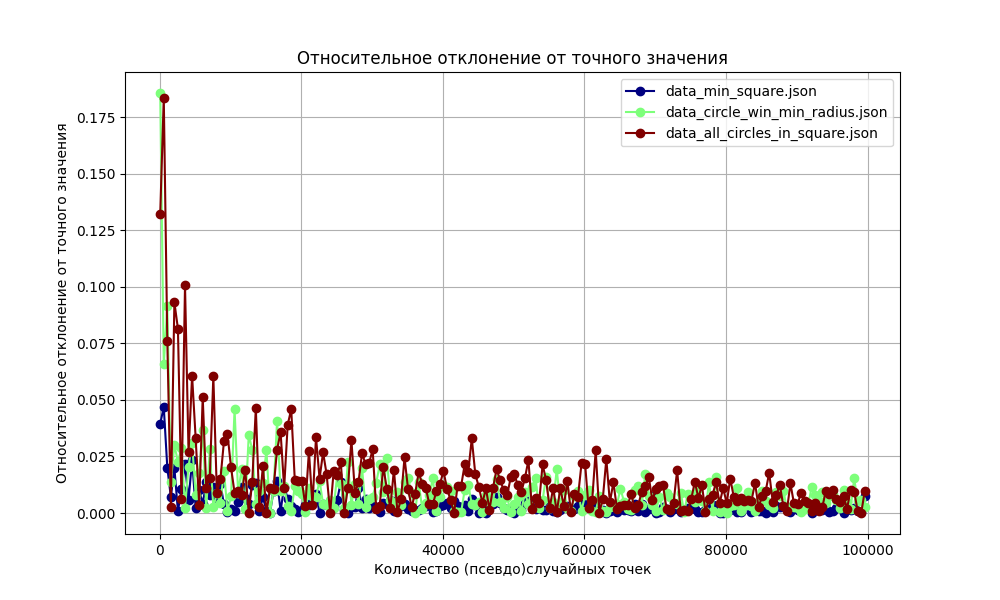

# Результаты экспериментов по вычислению площади пересечения трех кругов методом Монте-Карло

## Постановка задачи

Нам даны три окружности:

1. Центр в точке (1, 1) и радиус 1.
2. Центр в точке (1.5, 2) и радиус √5/2.
3. Центр в точке (2, 1.5) и радиус √5/2.

Необходимо вычислить приближенное значение площади фигуры, образованной в результате пересечения этих кругов. 
Кроме того, требуется оценить, насколько приближенная оценка площади отклоняется от ее точного значения в зависимости от параметров работы алгоритма Монте-Карло.

В процессе решения задачи найдено точное значение площади:

0.25 * pi + 1.25 * arcsin(0.8) - 1 ≋ 0.9445171858994637 (Источник: [WolframAlpha](https://www.wolframalpha.com/input?i=0.25+*+pi+%2B+1.25+*+arcsin%280.8%29+-+1))

## Результаты экспериментов

Всего было проведено 3 эксперимента для каждого из типа графиков:  
1) площадь квадрата, охватывающая все окружности  
2) площадь квадрата, охватывающая окружность с наименьшим радиусом  
3) площадь квадрата, описанная около пересечения трех окружностей  

Для удобства результаты экспериментов в каждой из групп объеденены в один график.  
Но вы можете посмотреть результаты отдельно для каждого из них в папке `output`.  

### График площади в зависимости от количества псевдослучайных чисел

**Описание:**

На этом графике показано, как меняется приближенное значение площади в зависимости от количества случайных точек (N) для разных масштабов прямоугольной области. Каждая линия на графике соответствует определенному масштабу.

**Выводы:**

1. **Увеличение количества точек (N):** С увеличением количества точек N приближенное значение площади стабилизируется и приближается к точному значению.
2. **Масштаб прямоугольной области:** При уменьшении масштаба прямоугольной области (охватывающей пересечение) приближенное значение площади также стабилизируется и приближается к точному значению.

### График относительного отклонения от точного значения

**Описание:**

На этом графике показано, как меняется относительное отклонение приближенного значения площади от ее точного значения в зависимости от количества случайных точек (N) и масштаба прямоугольной области. Каждая линия на графике соответствует определенному масштабу прямоугольной области.

**Выводы:**

1. **Увеличение количества точек (N):** С увеличением количества точек N относительное отклонение уменьшается, что свидетельствует о повышении точности приближенного значения площади.
2. **Масштаб прямоугольной области:** При уменьшении масштаба прямоугольной области относительное отклонение также уменьшается, так как меньшная область позволяет более точно аппроксимировать площадь пересечения кругов.

## Содержательные выводы

1. **Точность метода Монте-Карло:** Метод Монте-Карло позволяет аппроксимировать площадь пересечения кругов (и любых других фигур) с высокой точностью при достаточно большом количестве случайных точек (N) и подходящем масштабе прямоугольной области.
2. **Зависимость от количества точек:** Увеличение количества точек (N) значительно повышает точность вычислений, уменьшая относительное отклонение от точного значения площади.
3. **Зависимость от масштаба области:** Выбор масштаба прямоугольной области также важен для точности вычислений. Чем меньше площадь, охватывающая фигуру, тем точнее будет измерение.